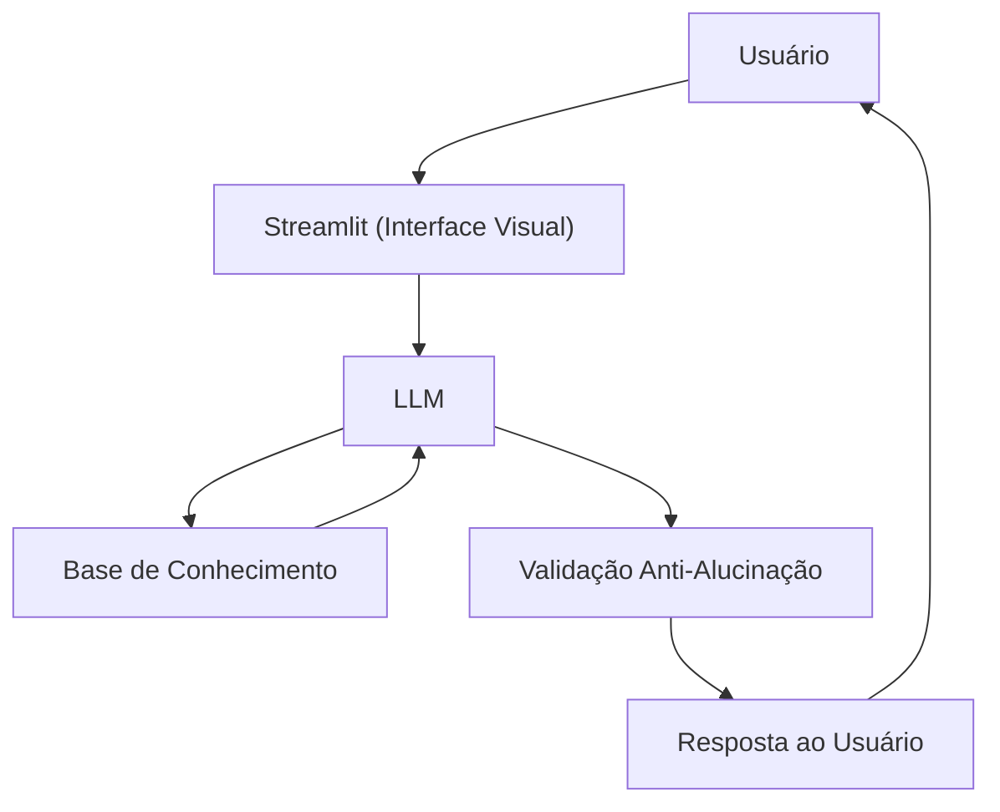

# 💼 Finn — Agente Consultor Financeiro Inteligente

Agente financeiro desenvolvido com IA Generativa como solução para o desafio da DIO.
Finn é um consultor direto, honesto e anti-alucinação, que orienta o usuário com base nos seus próprios dados financeiros.

---

## 🚀 Como Funciona

1. O usuário faz uma pergunta sobre investimentos ou finanças
2. O Finn analisa o perfil, transações e histórico do cliente
3. Responde de forma clara e personalizada — sem inventar informações
4. Se não souber algo, admite e redireciona corretamente

---

## 🛠️ Stack

| Componente | Tecnologia |
|------------|------------|
| Interface | Streamlit |
| LLM | Ollama (gpt-oss) — 100% local |
| Base de Conhecimento | JSON e CSV da pasta `data/` |

## 🏗️ Arquitetura



## 📁 Estrutura

```
├── data/                        
│   ├── perfil_investidor.json
│   ├── produtos_financeiros.json
│   ├── transacoes.csv
│   └── historico_atendimento.csv
│
├── docs/                        
│   ├── 01-documentacao-agente.md
│   ├── 02-base-conhecimento.md
│   ├── 03-prompts.md
│   ├── 04-metricas.md
│   └── 05-pitch.md
│
└── src/
    └── app.py                   
```

## ▶️ Como Rodar

```bash
# 1. Instalar dependências
pip install streamlit pandas requests

# 2. Iniciar o Ollama
ollama serve
ollama pull gpt-oss

# 3. Rodar a aplicação
streamlit run src/app.py
```

---

## 🛡️ Princípios do Finn

- Responde apenas com base nos dados fornecidos
- Admite quando não sabe algo
- Não recomenda investimentos sem considerar o perfil do cliente
- Não substitui um consultor certificado (CFP)
